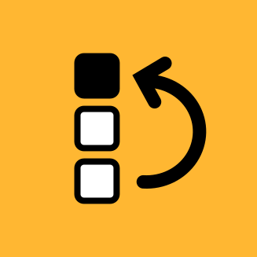

# Pic Bumper 🚀

  

> **Easily bump any meme to the very top of your photo album in seconds.**

Ever wanted to reply with a meme on **Bilibili**, **WeChat**, or social media, but couldn't find it because the image picker only sorts by the latest photos?

**Pic Bumper** solves this instantly: pick any meme, and bump its time sequence to **"Right Now"**. It immediately becomes the #1 newest photo in your album, ready to post!

---

## ✨ Why You'll Love It

- ⚡ **Instant Top Placement**: Move your favorite meme to the first spot in your album with a single tap.
- 🚀 **3-Tier Thumbnail Quality**: Choose between 100px (ultra-fast), 150px (balanced), and 240px (high-res) for silky smooth 120Hz grid scrolling.
- 🖼️ **Full-Screen Preview & On-Demand Metadata**: Tap any meme to view full screen, inspect image dimensions/size/timestamps via top-left Info toggle, or rename on the spot.
- 🔄 **Smart Duplicate Import Resolution**: Importing a meme with the same filename pops up a side-by-side comparison dialog (Keep Both, Replace, or Skip).
- 📁 **Keep Original Names**: Doesn't mess up your file names—your files keep their original names.
- 🗑️ **No Album Clutter**: When you re-bump a meme you used before, it automatically cleans up the older duplicate silently.
- 📂 **Native File Browsing**: Browse any folder on your phone, and select multiple memes at once.
- 🌙 **Eye-Friendly Dark Mode**: Designed with a pure black (AMOLED) dark theme, comfortable to use while chatting late at night.
- 🚀 **Zero Distractions**: No annoying pop-up toasts or full-screen interruptions.

---

## 📲 How to Use

1. Open **Pic Bumper**.
2. Tap the floating **"+"** button to pick memes from your phone.
3. Tap any single meme to preview or tap **"置頂" (Bump)**.
4. Done! Switch back to Bilibili or your chat app—your meme is now the very first image ready to send.

---

## 📥 Download & Install (APK)

You don't need Android Studio or any coding tools to install Pic Bumper!

1. Head over to the **Actions** tab of this repository on GitHub.
2. Click on the latest workflow run under **"Build Android APK"**.
3. Under the **Artifacts** section, download **`PicBumper-Debug-APK`**.
4. Unzip the downloaded file and install `app-debug.apk` directly on your Android phone!

---

## 🛠️ For Developers & AI Agents

Looking for architecture designs, MediaStore implementations, Scoped Storage rules, and build instructions?
👉 Please see **[DEVELOPMENT.md](DEVELOPMENT.md)**.

---

## License

MIT License
